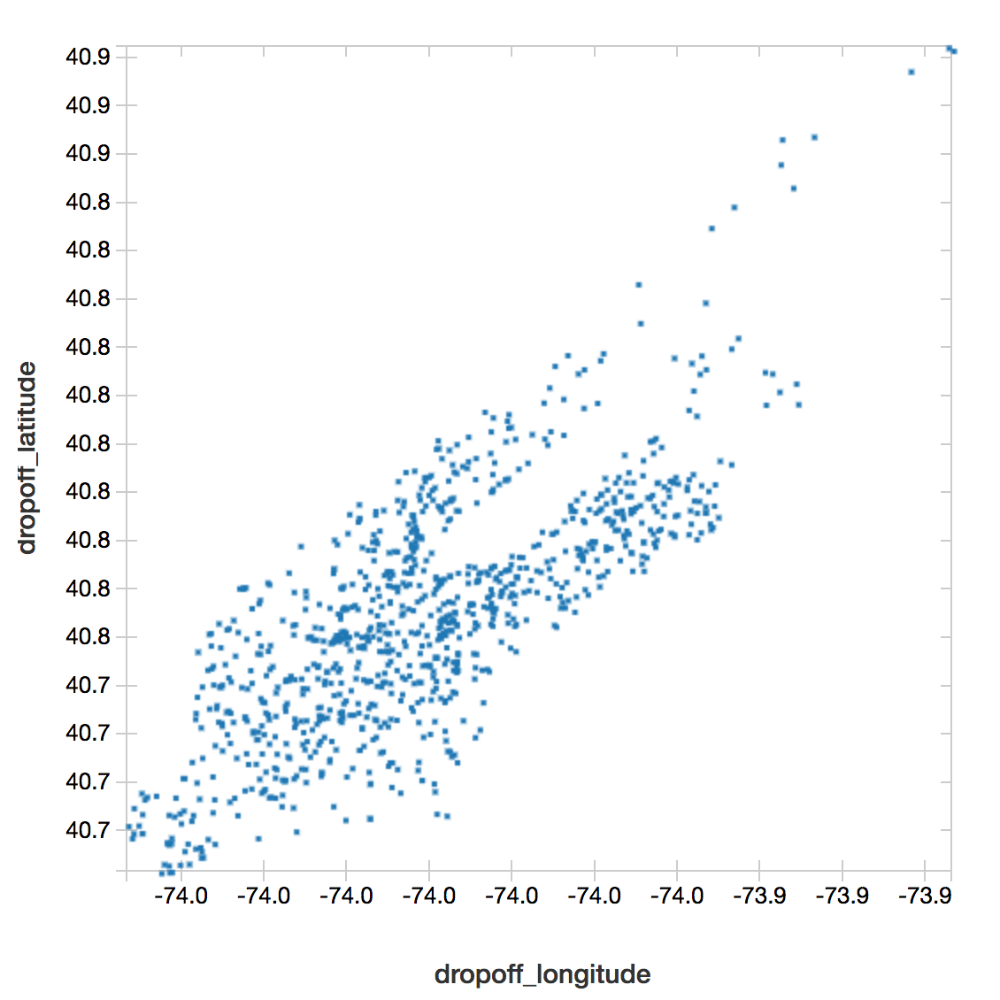

Title: Processing NYC Taxi Data Part 2: Geofiltering
Date: 2018-01-16 13:30
Tags: data science
Author: Ramon Dario Iglesias
Summary: In this multi-part series, I will process five years of taxi trips from the NYC TLC dataset. This part describes how to Spark to select only trips that happen within Manhattan.

## Intro

This is the second part of a series of posts in which I process five years of taxi data (~170GB) to make it suitable for training a forecasting model. 

In [the previous post](http://ramondario.com/processing-nyc-taxi-data-part-1-downloading.html), I described the steps to move the dataset to S3. In this post, I will filter the dataset so we keep only the trips that start and end in Manhattan. In essence, this task is the same as [the one I did using GeoPandas](http://ramondario.com/testing-new-yorks-taxi-dataset-googles-bigquery-and-geopandas.html), however, in this case I am dealing with a much larger dataset.

Therefore, I will use Spark to distribute the load to multiple machines. In particular, to avoid dealing with plumbing infrastructure, I will use [Databricks](https://databricks.com/).

## Setup Databricks

I will not get into the details of how to setup a Databricks account (you can follow the instructions in the website), nor how to connect it to your AWS account (you can use [this nifty guide](https://databricks.com/)). 

However, I do want to state what cluster configuration I used. The cluster consisted of `m4.large` EC2 instances (8 GB memory, 2 cores) with autoscaling enabled. The cluster had a minimum of one worker and maximum of 20, at most 10 of which were on-demand instances and the rest were spot instances with a bid price of 50% of the on-demand instances. All of the workers had Spark 2.2.1 and Scala 2.11. 

For geofiltering, I used the [Magellan library](https://github.com/harsha2010/magellan). You can install it via Databricks' UI. Because Magellan has mostly documentation in Scala (although they claim Python compatibility), in this post I will do the heavy lifting in Scala.

## GeoFiltering

The process is as follows:
    
    0. Preprocess the Manhattan GeoJSON polygon.
    1. Mount the S3 bucket to our workspace.
    2. Load the Manhattan GeoJSON polygon.
    3. Load the yellow cab trip data.
    4. Filter the dataset
    5. Save

### Preprocess the Manhattan GeoJSON

A prerequisite to the rest of the work is to have a suitable GeoJSON file that describes the area that counts as Manhattan. In particular, I wanted one that did not break down Manhattan into the different neighborhoods (since that would involver more preprocessing). I found a suitable GeoJSON file [here](https://raw.githubusercontent.com/ResidentMario/baruch-traders-club/master/data/manhattan.geojson). Let's download it:


```
wget https://raw.githubusercontent.com/ResidentMario/baruch-traders-club/master/data/manhattan.geojson -P /media/Big_Data/rdit/nyc-tlc/manhattan/
```


However, the Magellan library wants the geographical elements to be contained within a ["FeatureCollection"](http://geojson.org/geojson-spec.html#feature-collection-objects). Thus, the first step is to edit the file so the Manhattan polygon is a Feature within a FeatureCollection. To avoid much trouble, I did this using Python and GeoPandas:

```python
import geopandas as gpd

# where is the manhattan geojson

manhattan_file = '/media/Big_Data/rdit/nyc-tlc/manhattan/manhattan.geojson'

# load file
manh_df = gpd.read_file(manhattan_file)

print manh_df

manh_df.to_file('manhattan_joined.geojson', driver="GeoJSON")
```

GeoPandas automatically stores features within feature collections.

As before, we can load this file to S3 using the AWS CLI:

```
aws s3 sync /media/Big_Data/rdit/nyc-tlc s3://nyc-data
```

### Mount the S3 bucket to our workspace

In the nifty guide to setting up Databricks I mentioned earlier, it states how to create an AWS role so Databricks can operate in your AWS account. Within a notebook, you want to assign variables to the credentials corresponding to that role (`AccessKey`, `EncodedSecretKey`) and the bucket you will be using (`AwsBucketName`). More info [here](https://docs.databricks.com/spark/latest/data-sources/aws/amazon-s3.html).

With those credentials, I can mount the S3 bucket directly into our workspace:
```scala
// for setting the secrets follow the instructions in https://docs.databricks.com/spark/latest/data-sources/aws/amazon-s3.html
dbutils.fs.mount(s"s3a://$AccessKey:$EncodedSecretKey@$AwsBucketName", s"/mnt/$MountName")
```

### Load the GeoJSON

Loading the GeoJSON using Magellan is simple:

```scala
val manhdf = sqlContext.read.
  format("magellan").
  option("type", "geojson").
  load(ManhattanGeoJsonPath)
```

### Load the trip data

Loading the trip data is just slightly more complicated.

First, load the trip data in raw format:

```scala
// load all files
val nyc_raw = sqlContext.read.format("csv")
  .option("header", "true")
  .option("inferSchema", "true")
  .load("/mnt/nyc-data/*.csv")
```

Then I need to reconcile the columns (some columns are named different in different years/months).
```scala
// reconcile columns
val nyc_raw1 = nyc_raw
  .withColumnRenamed("Start_Lon", " pickup_longitude")
  .withColumnRenamed("Start_Lat", " pickup_latitude")
  .withColumnRenamed("End_Lon", " dropoff_longitude")
  .withColumnRenamed("End_Lat", " dropoff_latitude")
  .withColumnRenamed("Trip_Pickup_DateTime", " pickup_datetime")
  .withColumnRenamed("Trip_Dropoff_DateTime", " dropoff_datetime")
```

Now, convert those pickup and dropoff coordinates to Magellan Point objects. 

```scala
// imports
import magellan.{Point, Polygon, PolyLine}
import org.apache.spark.sql.magellan.dsl.expressions._
import org.apache.spark.sql.Row
import org.apache.spark.sql.types._
import org.apache.spark.sql.functions._

// helper functions
def makePoint( lon:Double, lat:Double ) : Point = {
    val p = Point(lon, lat)
    return p
    }

val makePointUDF = udf(makePoint(_:Double,_:Double))

// convert
val nyc_raw2 = nyc_raw1.withColumn("pickup_point", makePointUDF($" pickup_longitude", $" pickup_latitude")).
withColumn("dropoff_point", makePointUDF($" dropoff_longitude", $" dropoff_latitude"))
```

Now we are ready to filter!

### Filter the dataset and save

Filtering is now a simple join:

```scala
// filter them
val nyc_filtered = manhdf.
join(nyc_raw2).
where($"pickup_point" within $"polygon").
where($"dropoff_point" within $"polygon").
select($" pickup_datetime", $" dropoff_datetime", $" pickup_longitude", $" pickup_latitude", $" dropoff_longitude", $" dropoff_latitude")
```

and thats it!

We can peek into the filtered dataset by plotting a scatter plot:



and we notice that indeed, they have the form of Manhattan. 

We finally finish by storing the filtered dataset back to S3:

```scala
// store them in a separate folder
nyc_filtered.write
  .format("com.databricks.spark.csv")
  .option("header", "true")
  .save("/mnt/nyc-data/manhattan-only/trips.csv")
```

## Next Steps

In the next step, I will assign each trip to a specific region of Manhattan, and later in a final post I will store aggregate it into number of trips per Origin-Destination-Time triplets. 

